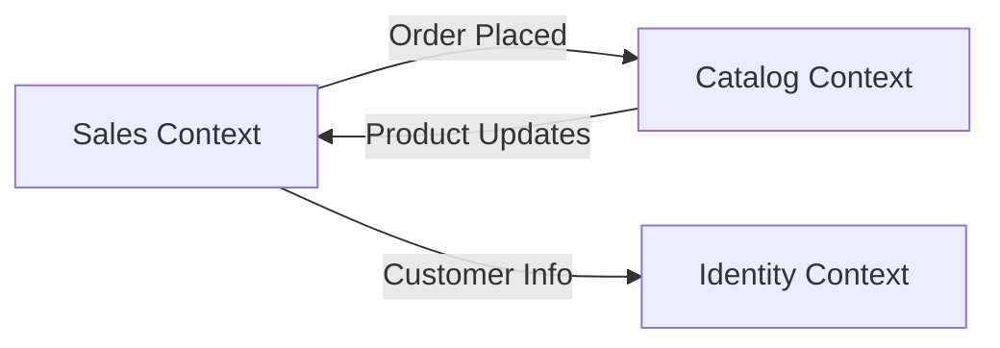

# DomainDrivenDesignUdemy

This solution demonstrates Domain-Driven Design (DDD) using a layered architecture and a clean separation between Domain, Application, Infrastructure, and Web API.

## Project Structure (Quick Map)

- **Domain**: Pure domain model (entities, value objects, aggregates, domain rules).
- **Application**: Use cases and orchestration (MediatR handlers, domain event handlers).
- **Infrastructure**: EF Core persistence, repositories, and external integrations.
- **WebApi**: HTTP endpoints and composition root.

## Domain Model Highlights (from code)

- **Entities**: `Entity` base class provides identity and equality.
- **Aggregates**:
	- `Order` is an aggregate root controlling `OrderLine` creation/removal.
	- `Category` and `Product` form another aggregate boundary (category owns product list).
	- `User` is an aggregate root with behavior methods.
- **Value Objects**: `Money`, `Name`, `Email`, `Address`, `Password` (immutability, equality by value).
- **Repositories**: Interfaces such as `IOrderRepository`, `IProductRepository`, `IUserRepository` (in Domain) for persistence abstraction.
- **Domain Services / Events**: Hooks are prepared (domain event handlers referenced in Application DI).

## DDD Concepts Explained

### Ubiquitous Language
DDD starts with a shared vocabulary between developers and domain experts. Here, terms like **Order**, **OrderLine**, **Money**, **Category**, and **User** are part of the ubiquitous language, reflected directly in code.

### Tactical Design (Inside a Bounded Context)
Tactical design is about modeling the domain with building blocks:

- **Entities**: Objects with identity over time. Example: `Order`, `User`, `Product`.
- **Value Objects**: Immutable objects that are compared by value. Example: `Money`, `Name`, `Email`.
- **Aggregates**: Consistency boundaries. The aggregate root is the only entry point for changes inside the aggregate.
	- `Order` controls `OrderLine` creation and removal, ensuring invariants like quantity > 0.
- **Factories**: Creation logic outside constructors, often as static methods (see `User.CreateUser`).
- **Repositories**: Collection-like interfaces for aggregates that hide persistence.
- **Domain Events**: Signals that something meaningful occurred. The Application project registers handlers, ready for domain event workflows.

### Strategic Design (Across the System)
Strategic design defines *where* models live and *how* they relate.

#### Bounded Context
A bounded context is a boundary within which a particular model is valid. In this solution, the core model is in the `Domain` project. As the system grows, you can split into multiple contexts such as:

- **Sales Context**: Orders, OrderLines, Pricing rules.
- **Catalog Context**: Categories and Products.
- **Identity Context**: Users, authentication, profile data.

Each context can have its own model, storage, and language without forcing one model to fit all.

#### Subdomains
Subdomains describe business areas:

- **Core Domain**: The key differentiator (likely Orders/Sales here).
- **Supporting Subdomains**: Required but not unique (Catalog, Users).
- **Generic Subdomains**: Commodity concerns (Authentication, Emailing, Logging).

#### Context Mapping
Context mapping describes integration between bounded contexts. Common patterns include:

- **Partnership**: Two teams evolve together.
- **Customer/Supplier**: One team depends on another’s model.
- **Conformist**: A context adopts another’s model to integrate.
- **Anti-Corruption Layer (ACL)**: Translate between models to prevent leakage.

In this solution, you can evolve toward separate contexts by introducing separate application layers or services, and map them with explicit interfaces or integration events.

## Suggested Strategic View (Example)

## How to Extend

- Add domain events when aggregates change state, then handle them in Application.
- Split bounded contexts into separate projects/services as complexity grows.
- Introduce integration events or an ACL when integrating with external systems.

## Running the Solution

- Set `DomainDrivenDesignUdemy.WebApi` as startup project.
- Run the Web API and explore endpoints via Swagger UI.

---